```{r setup, include = FALSE}
options(htmltools.dir.version = FALSE)
knitr::opts_chunk$set(message = FALSE, warning = FALSE, fig.align = "center")
xaringanExtra::use_tachyons()
xaringanExtra::use_tile_view()
xaringanExtra::use_panelset()
```

```{r library, include = FALSE}
library(tidyverse)
library(here)
```


# Trabajo de referencia

```{r, echo = FALSE, eval = TRUE, fig.asp = 2/2, out.width = "100%", fig.align = "center"}
knitr::include_graphics("./img/01_MonoFRA.jpg")
```

<br/>

El [trabajo](https://www.ivie.es/es_ES/ptproyecto/distribucion-la-poblacion-acceso-los-servicios-publicos/) trata de poner en relación la distribución de la población sobre el territorio con la dotación de (algunos) centros de servicios: Sanidad, educación no universitaria y oficinas bancarias.

--

<br/>

Adopta una **perspectiva nacional**, una **escala local** (municipal) y un **enfoque geográfico**.

???

Mejorar la accesibilidad a los servicios de interés general, públicos y privados, es una parte importante tanto de las políticas sociales como de las políticas territoriales de cohesión social.

La accesibilidad, entendida en un sentido amplio, tiene múltiples facetas y hace referencia a la facilidad con la que la población, dadas sus características y su distribución sobre el territorio, puede disfrutar de dichos servicios.

Con muy pocas excepciones los estudios generales sobre accesibilidad geográfica a servicios de interés general son de ámbito local o a lo sumo regional. La razón es que, desafortunadamente, información amplia y completa sobre la localización de este tipo de servicios no está disponible con generalidad.

---

# El origen... ¡un artículo de prensa! `r icons::icon_style(icons::fontawesome("newspaper"), fill = "blue")`

```{r, echo = FALSE, eval = TRUE, fig.asp = 2/2, out.width = "100%", fig.align = "center"}
knitr::include_url("https://elpais.com/politica/2019/10/25/actualidad/1572027354_718725.html")
```

```{r, echo = FALSE, eval = TRUE, fig.asp = 2/2, out.width = "85%", fig.align = "center"}
#knitr::include_graphics("./img/02_EL_Pais.jpg")
```

???

**Objetivo**: Mejorar la base de datos y hacerse una idea la foto a nivel nacional.

---

exclude: true

# Antecedentes

.pull-left[

```{r, echo = FALSE, eval = TRUE, fig.asp = 2/2, out.width = "85%", fig.align = "center"}
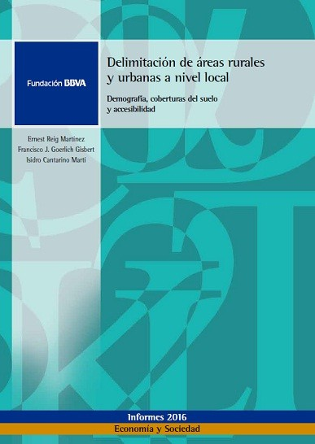
```

]

.pull-right[ 

```{r, echo = FALSE, eval = TRUE, fig.asp = 2/2, out.width = "90%", fig.align = "center"}
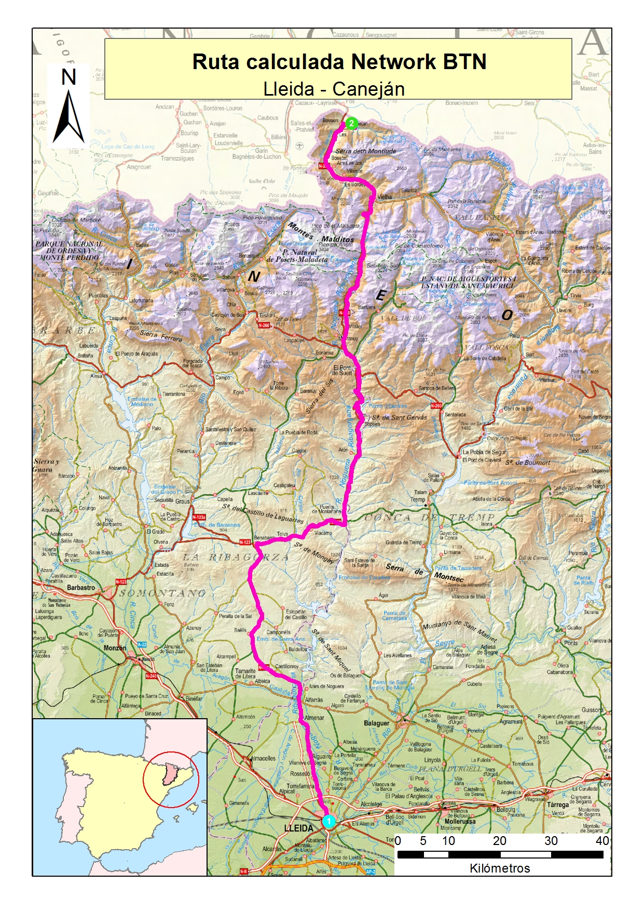
```

]

???

Ya habíamos mirado el tema de la accesibilidad en el contexto de la discriminación entre municipios rurales accesibles y remotos al hilo de una literatura europea que hace énfasis en el mejor desempeño de los municicipios rurales cercanos a las ciudades frente a los municipios remotos.

---

exclude: true

# La importancia de la cercanía

```{r, echo = FALSE, eval = TRUE, fig.asp = 2/2, out.width = "80%", fig.align = "center"}
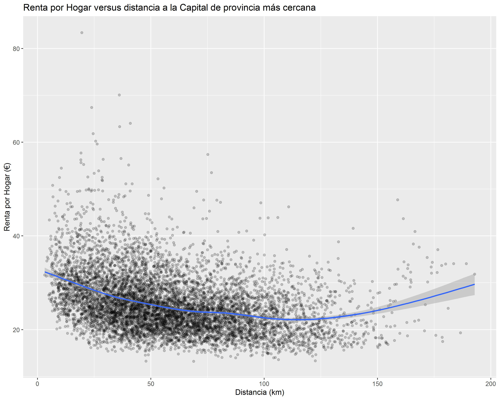
```

???

Una mirada a los datos muestra que los **municipios cercanos** a los grandes centros de servicio, _las ciudades_, tienden a mostrar **mejor desempeño** que los **municipios remotos**, alejados de los centros de servicios.

Ya sea en términos de la **cercanía** a la **capital de provincia** más cercana...

---

exclude: true

# La importancia de la cercanía

```{r, echo = FALSE, eval = TRUE, fig.asp = 2/2, out.width = "80%", fig.align = "center"}
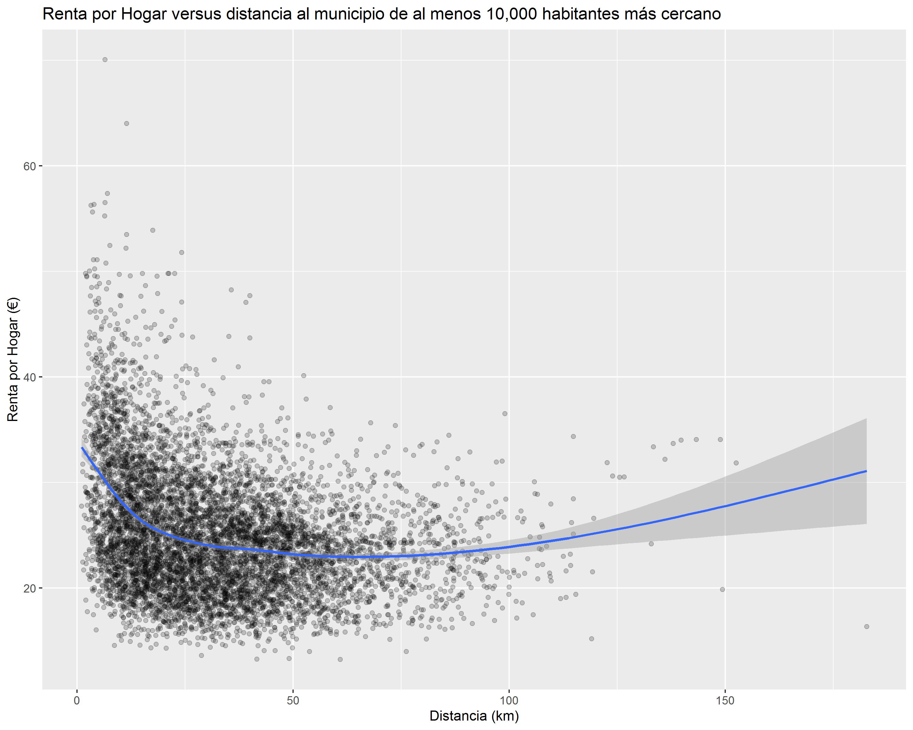
```

???

...o a un **municipio por encima de un determinado umbral**.

Aproximadamente el mismo patrón se observa para otros tamaños de municipios.

Si bien, la relación está lejos de ser lineal.

---

# Accesibilidad a los servicios

Una aproximación cuantitativa a la accesibilidad puede adoptar diferentes enfoques y ser medida de distintas formas.

--

En general, la accesibilidad es una combinación de dos funciones diferentes:

1. El **tipo de actividades** que se pueden/desean alcanzar.

2. El **coste** en el que debemos incurrir para alcanzarlas. Coste del usuario o del prestatario.

--

Nos centramos en servicios muy concretos y generales: **Sanidad** `r icons::icon_style(icons::fontawesome("hospital"), fill = "blue")`, **Educación no universitaria** `r icons::icon_style(icons::fontawesome("school"), fill = "blue")` y **Oficinas Bancarias** `r icons::icon_style(icons::ionicons("cash"), fill = "blue")`.

Y en el **coste** por parte del que **accede al servicio** en términos de **distancia y/o tiempo de acceso**.

**No** consideramos el **coste de provisión**, ¡un olvido terriblemente importante!

En la accesibilidad es uno de los ámbitos donde se hace más patente el **conflicto eficiencia-equidad**.

???

Una mayor provisión de servicios locales, especialmente en las zonas rurales más despobladas, contribuiría a reducir el déficit identificado en estas zonas frente a las zonas urbanas, y redundaría en mejoras sociales y de bienestar para algunos ciudadanos. Sin embargo, un aumento generalizado en la provisión de servicios públicos conllevaría perdidas de eficiencia, en tanto que dicho gasto elevaría el coste medio de los servicios por habitante. El mismo argumento se aplica a los servicios privados, que en el caso de no se rentables requirirían la intervención pública o, si se actúa vía la obligatoriedad en la provisión de dichos servicios, el reparto del coste entre todos los usuarios.

Este equilibrio debe resolverse en el ámbito político, en tanto que éste refleja, en teoría, la agregación de las preferencias de los individuos, pero es aconsejable que las decisiones se basen en la evidencia empírica.

---

class: inverse, center, middle

# Distribución de la población

<br/>

Sin **población**, `r icons::icon_style(icons::ionicons("people"), fill = "white")`, no hay servicios que prestar.

???

¡Debemos empezar por saber donde están los usuarios potenciales!

---

# Distribución de la población

La población española se ha multiplicado por 2.5 veces en los últimos 120 años... ¡pero muchos lugares han perdido población!

.center[**Variación absoluta de la población por municipios, 1900-2020**]

```{r, echo = FALSE, eval = TRUE, fig.asp = 2/2, out.width = "70%", fig.align = "center"}
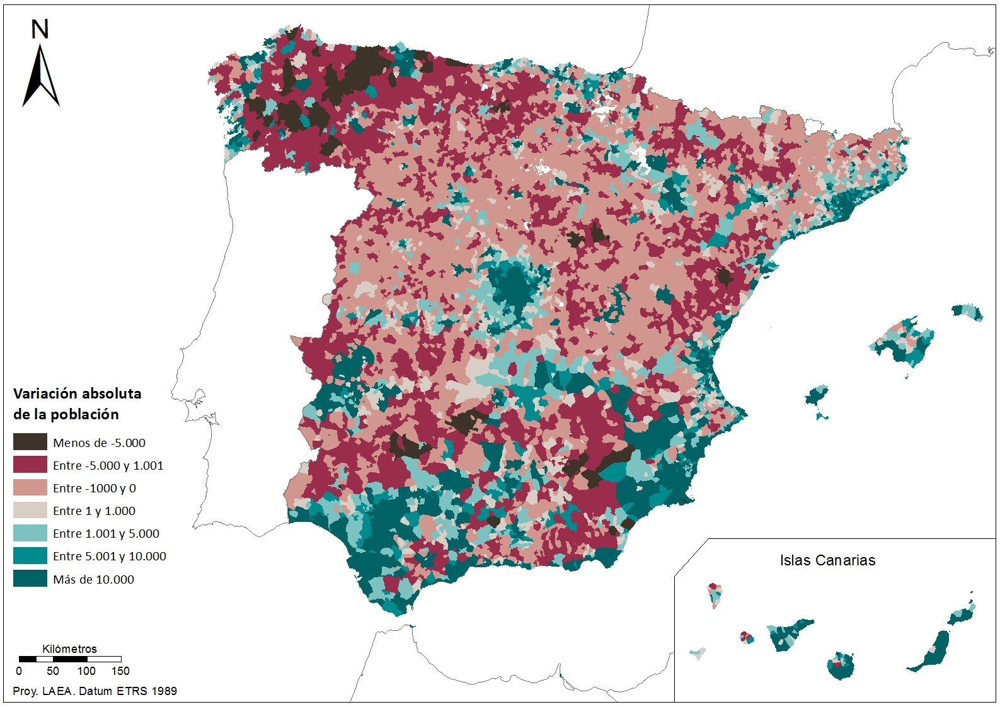
```

???

¡Estos son los territorios que decrecen!

---

class: center

#### Densidad de población

```{r, echo = FALSE, eval = TRUE, fig.asp = 2/2, out.width = "50%", out.height = "50%", fig.show = "hold", fig.align = "default"}
knitr::include_graphics(c("./img/08_Densidad_1900.jpg", "./img/09_Densidad_1950.jpg",
                          "./img/10_Densidad_2001.jpg", "./img/11_Densidad_2020.jpg"))
```

---

# ¡España está casi vacía!

.center[**Grid de población 2011 con tamaño de celda 1km² x 1km²**]

```{r, echo = FALSE, eval = TRUE, fig.asp = 2/2, out.width = "80%", fig.align = "center"}
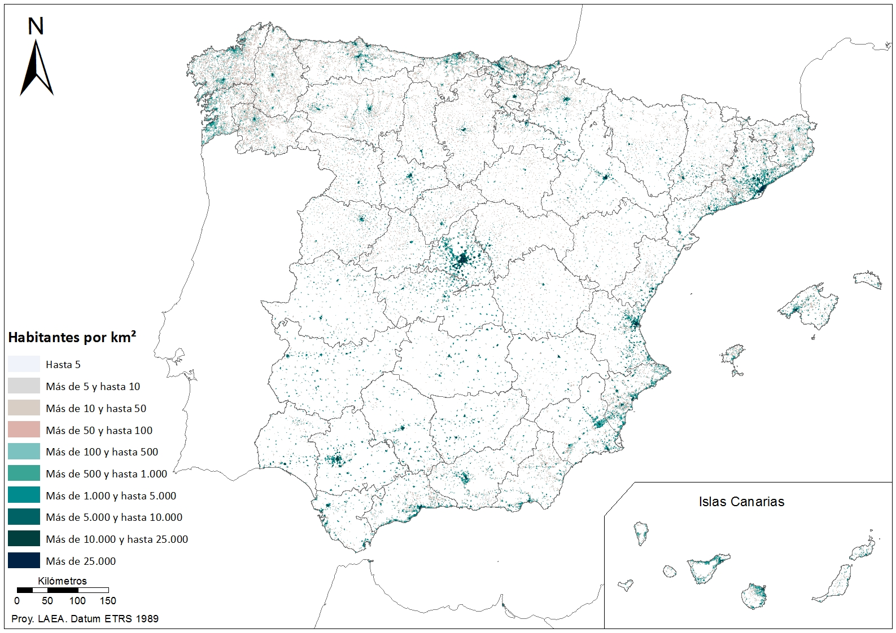
```

---

class: inverse, center, middle

### Si la población se ha multiplicado por 2.5 en el último siglo y

### una gran parte del territorio ha mermado...

<br/>

### _¿Donde ha ido la población?_

---

# A la costa...

```{r, echo = FALSE, eval = TRUE, fig.asp = 2/2, out.width = "85%", fig.align = "center"}
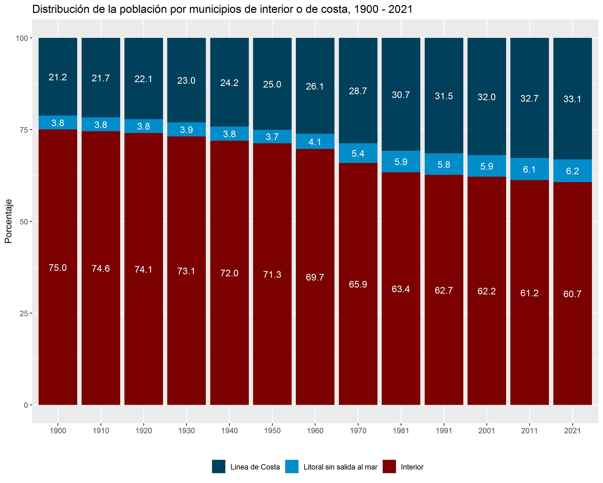
```

---

# Al valle...

```{r, echo = FALSE, eval = TRUE, fig.asp = 2/2, out.width = "85%", fig.align = "center"}
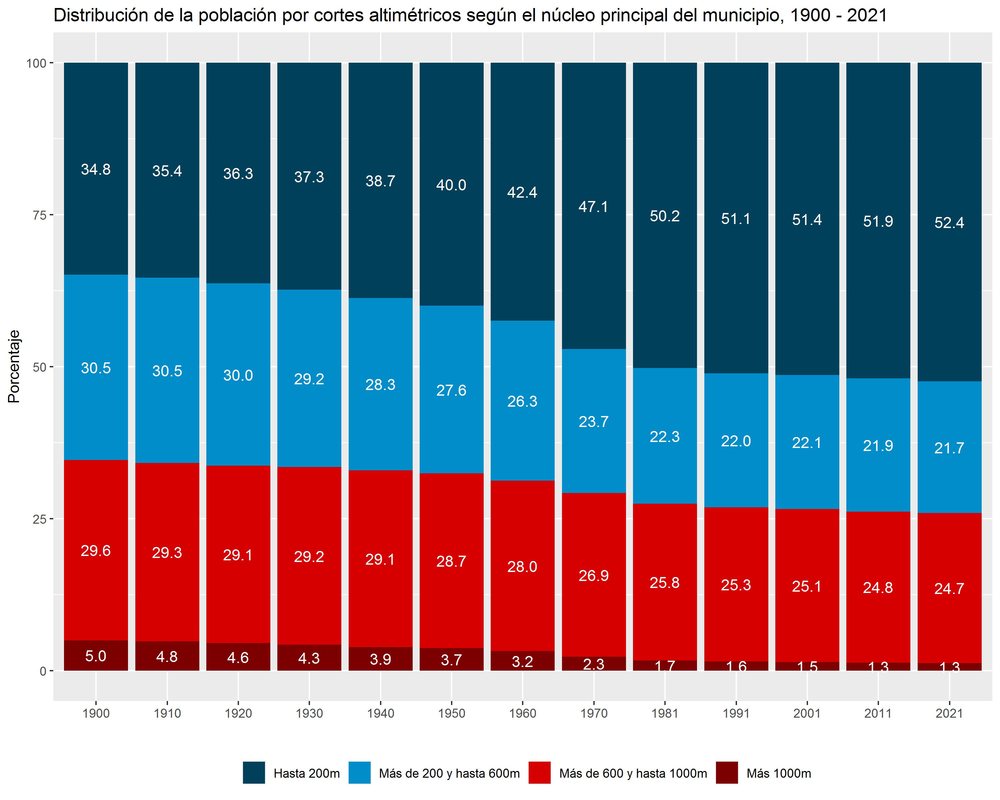
```

---

# A los municipios urbanos...

```{r, echo = FALSE, eval = TRUE, fig.asp = 2/2, out.width = "85%", fig.align = "center"}
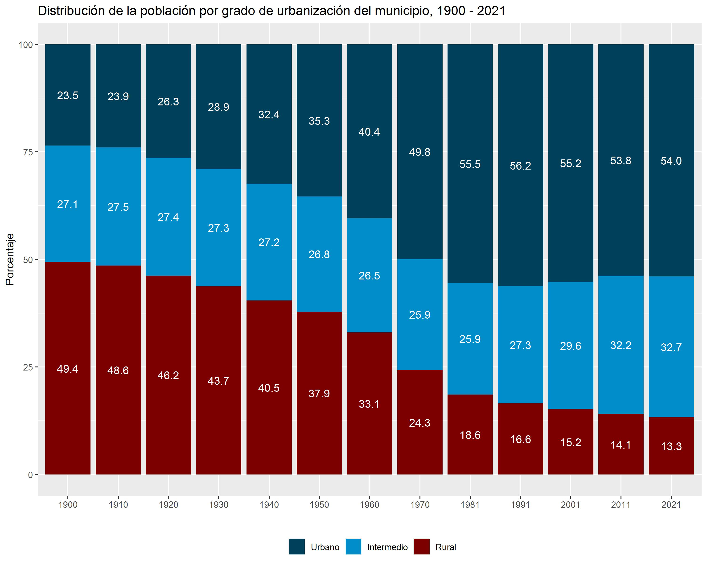
```

---

# A las capitales de provincia...

```{r, echo = FALSE, eval = TRUE, fig.asp = 2/2, out.width = "85%", fig.align = "center"}
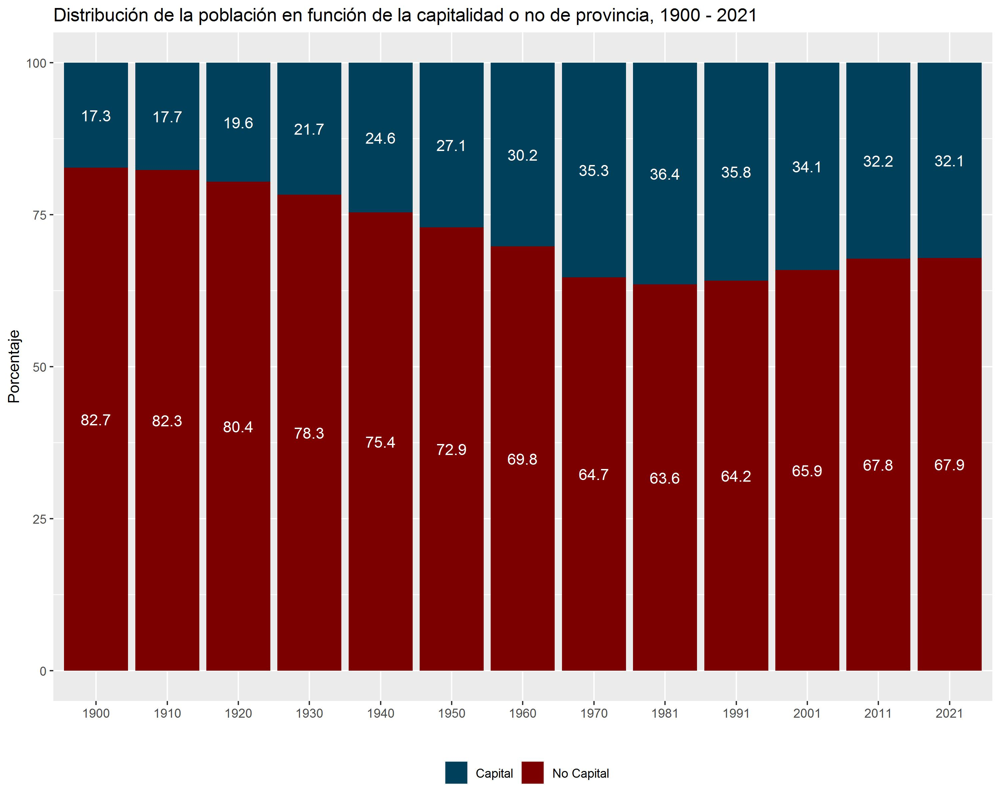
```

---

# A las áreas urbanas funcionales...

```{r, echo = FALSE, eval = TRUE, fig.asp = 2/2, out.width = "85%", fig.align = "center"}
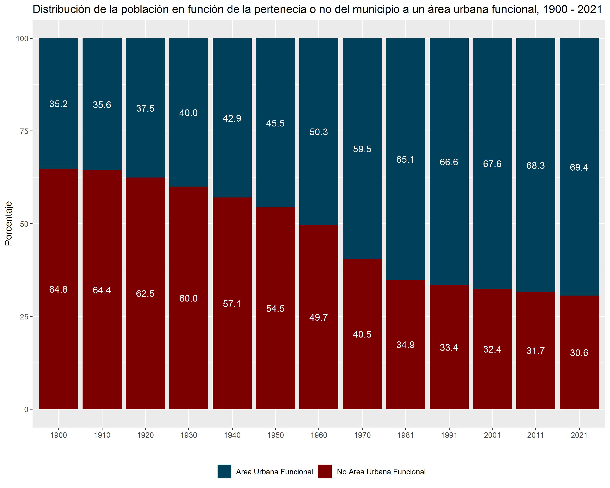
```

---

# A Madrid...

```{r, echo = FALSE, eval = TRUE, fig.asp = 2/2, out.width = "85%", fig.align = "center"}
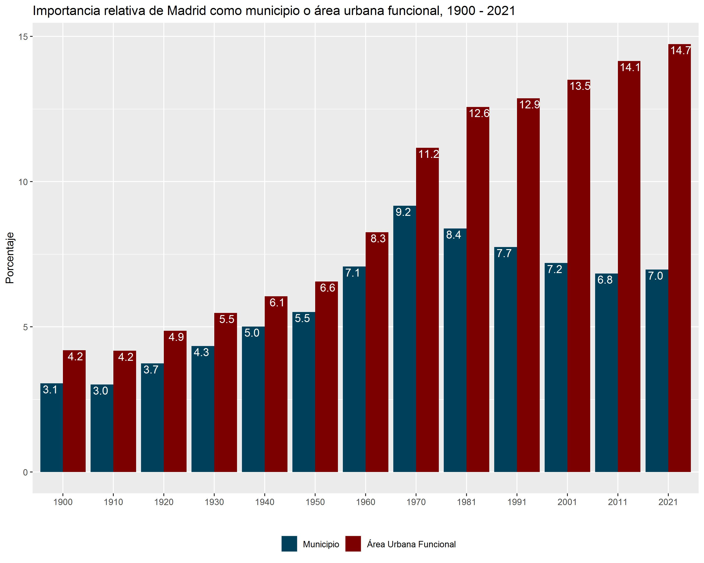
```

---

class: inverse, center, middle

### ¿Ha acabado este proceso de concentración de la población?

--

### _¡Yo creo que no!_

---

# Estructura sociodemográfica actual

La **principal particularidad demográfica** que ha dejado el éxodo rural de la segunda mitad siglo pasado es la **abundancia de lugares casi vacíos** y un notable proceso de **envejecimiento de la población** en amplias zonas de nuestro país.

<br/>

Este **proceso** no operó ni en todos los lugares, ni en todas las épocas de la misma forma, y **no** parece que esté **agotado**.

<br/>

¡Lo que llevamos de siglo XXI no ha conseguido revertir las tendencias previas!

<br/>

Debemos pues esperar que el proceso de concentración, y envejecimiento, de la población prosigua de forma lenta pero continuada en el tiempo.

---

#### .center[Indicadores demográficos por tamaño de municipio, 2021]

```{r, echo = FALSE, eval = TRUE, fig.asp = 2/2, out.width = "80%", fig.align = "center"}
DemoTama <- read_csv(here("data", "IndDemo_TamaMuni.csv")) %>%
  select(TamaMuni, N, Superficie, Altitud, POB, EM, PobM16, Pob65M, IE, TD, RM, PobEXT, PobMMR, RPH) %>%
  mutate(Pob = 100*POB/sum(POB), .after = POB) %>%
  rename(Municipios = N, `Superficie (km²)` = Superficie, `Altitud (m)` = Altitud, Población = POB, `Población (%)` = Pob,
         `Edad Media` = EM, `Población menor de 16 años (%)` = PobM16, `Población de 65 años y más (%)` = Pob65M,
         `Índice de envejecimiento` = IE, `Tasa de dependencia` = TD, `Ratio de masculinidad` = RM,
         `Población Extranjera (%)`  = PobEXT, `Población nacida en el mismo municipio de residencia (%)` = PobMMR,
         `Renta por Hogar (€)`  = RPH, `Tramos de población` = TamaMuni)

DT::datatable(DemoTama, extensions = "FixedColumns",
              options = list(dom = "rtip", pageLength = 4, scrollX = TRUE, fixedColumns = list(leftColumns = 2))) %>%
  DT::formatRound("Municipios", digits = 0, mark = ".") %>%
  DT::formatRound("Superficie (km²)", digits = 0, mark = ".", dec.mark = ",") %>%
  DT::formatRound("Altitud (m)", digits = 0, mark = ".", dec.mark = ",") %>%
  DT::formatRound("Población", digits = 0, mark = ".", dec.mark = ",") %>%
  DT::formatRound("Población (%)", digits = 1, mark = ".", dec.mark = ",") %>%
  DT::formatRound("Edad Media", digits = 0, mark = ".", dec.mark = ",") %>%
  DT::formatRound("Población menor de 16 años (%)", digits = 1, mark = ".", dec.mark = ",") %>%
  DT::formatRound("Población de 65 años y más (%)", digits = 1, mark = ".", dec.mark = ",") %>%
  DT::formatRound("Índice de envejecimiento", digits = 0, mark = ".", dec.mark = ",") %>%
  DT::formatRound("Tasa de dependencia", digits = 0, mark = ".", dec.mark = ",") %>%
  DT::formatRound("Ratio de masculinidad", digits = 0, mark = ".", dec.mark = ",") %>%
  DT::formatRound("Población Extranjera (%)", digits = 1, mark = ".", dec.mark = ",") %>%
  DT::formatRound("Población nacida en el mismo municipio de residencia (%)", digits = 1, mark = ".", dec.mark = ",") %>%
  DT::formatRound("Renta por Hogar (€)", digits = 0, mark = ".", dec.mark = ",")
```

---

#### .center[Indicadores demográficos por grado de urbanización, 2021]

```{r, echo = FALSE, eval = TRUE, fig.asp = 2/2, out.width = "80%", fig.align = "center"}
DemoUrba <- read_csv(here("data", "IndDemo_DEGURBA.csv")) %>%
  select(Descripcion, N, Superficie, Altitud, POB, EM, PobM16, Pob65M, IE, TD, RM, PobEXT, PobMMR, RPH) %>%
  mutate(Pob = 100*POB/sum(POB), .after = POB) %>%
  rename(Municipios = N, `Superficie (km²)` = Superficie, `Altitud (m)` = Altitud, Población = POB, `Población (%)` = Pob,
         `Edad Media` = EM, `Población menor de 16 años (%)` = PobM16, `Población de 65 años y más (%)` = Pob65M,
         `Índice de envejecimiento` = IE, `Tasa de dependencia` = TD, `Ratio de masculinidad` = RM,
         `Población Extranjera (%)`  = PobEXT, `Población nacida en el mismo municipio de residencia (%)` = PobMMR,
         `Renta por Hogar (€)`  = RPH, `Grado de urbanización` = Descripcion)

DT::datatable(DemoUrba, extensions = "FixedColumns",
              options = list(dom = "rti", pageLength = 4, scrollX = TRUE, fixedColumns = list(leftColumns = 2))) %>%
  DT::formatRound("Municipios", digits = 0, mark = ".") %>%
  DT::formatRound("Superficie (km²)", digits = 0, mark = ".", dec.mark = ",") %>%
  DT::formatRound("Altitud (m)", digits = 0, mark = ".", dec.mark = ",") %>%
  DT::formatRound("Población", digits = 0, mark = ".", dec.mark = ",") %>%
  DT::formatRound("Población (%)", digits = 1, mark = ".", dec.mark = ",") %>%
  DT::formatRound("Edad Media", digits = 0, mark = ".", dec.mark = ",") %>%
  DT::formatRound("Población menor de 16 años (%)", digits = 1, mark = ".", dec.mark = ",") %>%
  DT::formatRound("Población de 65 años y más (%)", digits = 1, mark = ".", dec.mark = ",") %>%
  DT::formatRound("Índice de envejecimiento", digits = 0, mark = ".", dec.mark = ",") %>%
  DT::formatRound("Tasa de dependencia", digits = 0, mark = ".", dec.mark = ",") %>%
  DT::formatRound("Ratio de masculinidad", digits = 0, mark = ".", dec.mark = ",") %>%
  DT::formatRound("Población Extranjera (%)", digits = 1, mark = ".", dec.mark = ",") %>%
  DT::formatRound("Población nacida en el mismo municipio de residencia (%)", digits = 1, mark = ".", dec.mark = ",") %>%
  DT::formatRound("Renta por Hogar (€)", digits = 0, mark = ".", dec.mark = ",")
```

---

# .center[Cara y cruz del fuerte proceso de concentración de la población]

<br/>

- Por una parte, genera amplias zonas del territorio con muy baja densidad demográfica, con una población mayor, envejecida y, en muchos lugares, con escasas perspectivas económicas. El llamado **reto demográfico**.

<br/>

- Por otra parte, **este patrón de localización facilita el acceso de una gran parte de la población a los servicios** sanitarios, educativos y de oficinas bancarias. La mayor parte de la población dispone de centros de servicios en sus municipios de residencia, y cuando ello no es así, los tiempos de acceso son, en su mayoría, razonables.

???

**Respecto a la despoblación**: En los casi 6.000 municipios que no superan los 2.000 habitantes, la renta por hogar se sitúa alrededor de un 20% por debajo del promedio nacional, frente al 20% por encima del promedio nacional que disfrutan los municipios de más de 500.000 habitantes. El rango en renta por hogar es, pues, considerable.

**Respecto a los servicios**: La mayor parte de la población dispone de centros de servicios en sus municipios de residen-cia, y cuando ello no es así, los tiempos de acceso son, en su mayoría, razonables.

Los casi 6.000 municipios que no superan los 2.000 habitantes albergan el 5,7% de la población, 2,7 millones de residentes, mientras que en los 6 municipios con más de 500.000 habitantes reside el triple de la población (16,2%), 7,6 millones de personas. Esta cifra asciende al 40%, 18,8 millones, si consideramos los municipios de más de 100.000 habitantes.

Naturalmente la atomización de la distribución municipal --más de 1.300 municipios no sobrepasan los 100 habitantes-- deja una parte pequeña de la población con peor acceso a los servicios de interés general, tanto en dotaciones como en tiempos de acceso. Son además poblaciones de montaña, con una altitud media que supera los 900 metros, y peores comunicaciones. Sin embargo, el problema está suficientemente acotado desde el punto de vista demográfico.

Los casi 4.000 municipios que no superan los 500 habitantes albergan a una población inferior al millón de habitantes (solo el 1,6% del total de la población española).

---

class: inverse, center, middle

## Examinemos una gran foto de la accesibilidad a Servicios Sanitarios, Educativos y de Oficinas Bancarias.

---

## Servicios Sanitarios: Hospitales `r icons::icon_style(icons::fontawesome("hospital"), fill = "blue")`

.bg-washed-green.b--dark-green.ba.bw2.br3.shadow-5.ph4.mt4[

- El 55% de la población reside en un municipio que dispone de hospital.

- El 91% de la población reside en un municipio con hospital o se encuentra a menos de 30 minutos de viaje de alguno.

- Alrededor de 1 millón de personas —el 2.1% de la población— tienen que invertir más de 45 minutos para llegar al hospital más cercano.

- La geografía de las zonas con peor accesibilidad está claramente delimitada. Se trata de áreas montañosas, en ocasiones con comunicaciones difíciles.  También algunas áreas en las periferias provinciales —Guadalajara, Cuenca, Teruel, Badajoz o Huesca—, alejadas de la capital.

- Cuando descendemos a nivel provincial las disparidades son mucho más elevadas.

]

???

**Áreas montañosas con comunicaciones difíciles**: Picos de Europa, zonas del Pirineo, la Serranía de Cuenca, Montes de León, la Serranía de Gredos, la Sierra de Alcaraz y la vertiente sur de Sierra Nevada.

---

### .center[Tiempo de viaje al hospital más cercano]

```{r, echo = FALSE, eval = TRUE, fig.asp = 2/2, out.width = "98%", fig.align = "center"}
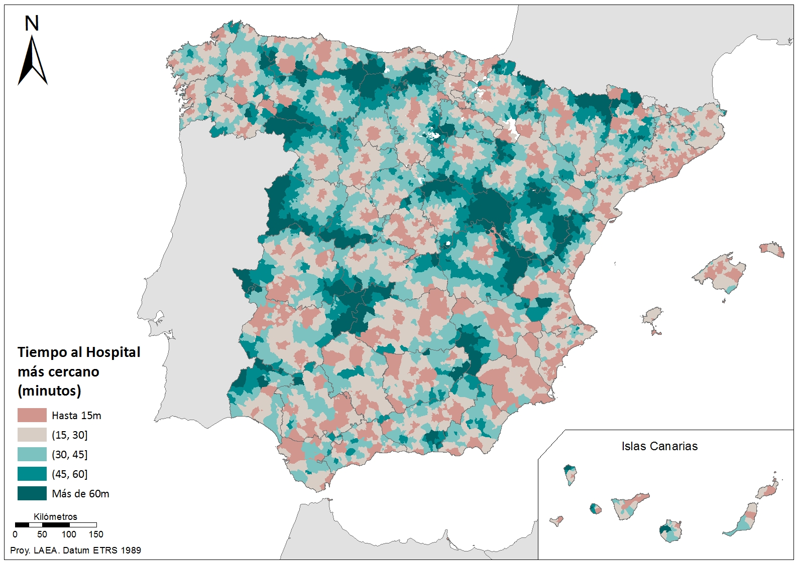
```

???

Cometar las zonas con peor acceso. Los efectos frontera y el efecto de la lejanía de la capital.

---

## Servicios Sanitarios: Centros de Atención Primaria `r icons::icon_style(icons::fontawesome("hospital"), fill = "blue")`

.bg-washed-green.b--dark-green.ba.bw2.br3.shadow-5.ph4.mt4[

- Centros de Atención Primaria (CAP): presentes en la casi totalidad de los municipios. Solo unos 200 municipios carecen de ellos.

- La mayoría de los CAP, unos 10.000, son Consultorios Locales con una atención muy limitada y normalmente discontinua. El pilar básico son los Centros de Salud (CS), algo más de 3.000.

- Los CS están presentes en el 33% de los municipios que engloban al 88% de la población.

- Por tanto, **el 77% de municipios carece de CS**. Ello afecta al **12% de la población** —unos 5,6 millones de personas—.

- El 90% de la población tiene acceso a un CS en su municipio o en un tiempo de viaje de unos 10 minutos, y solo el 1,3% de la población debe desplazarse más de 20 minutos.

- En los casos más extremos, unas 100.000 personas, de algo menos de 300 municipios, tienen un CS a más de 30 minutos.

]

---

### .center[Tiempo de viaje al Centro de Salud más cercano]

```{r, echo = FALSE, eval = TRUE, fig.asp = 2/2, out.width = "98%", fig.align = "center"}
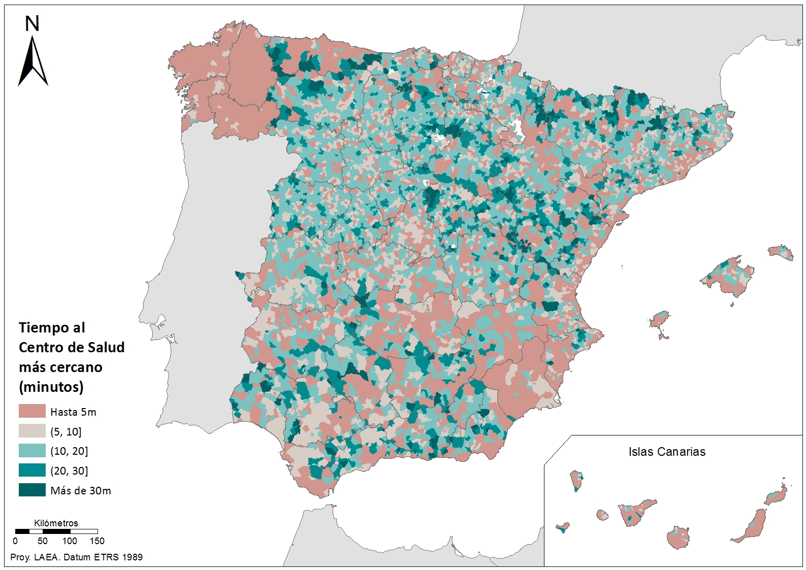
```

---

### .center[Diferencias Provinciales: % de población sin CS en su municipio]

```{r, echo = FALSE, eval = TRUE, fig.asp = 2/2, out.width = "98%", fig.align = "center"}
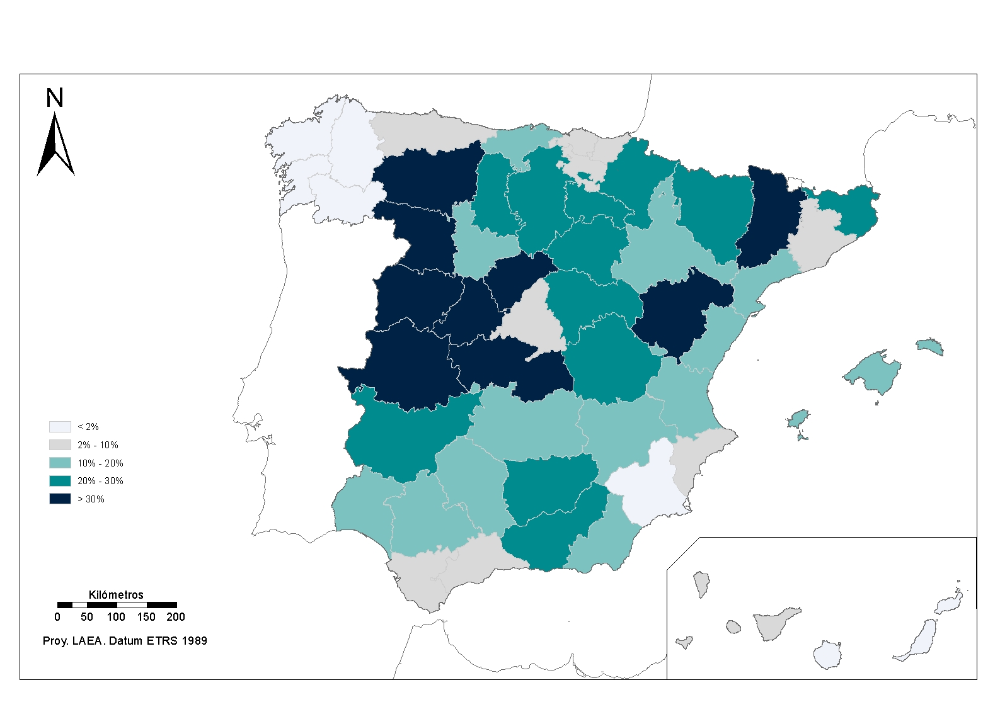
```

???

A nivel regional existen importantes diferencias en cuanto a cobertura, lo que se debe fundamentalmente a dos factores. A la propia demografía, muy dispar entre comunidades autónomas, y a las diferentes formas de organizar la prestación de servicios sanitarios de las distintas comunidades en uso de sus atribuciones. Así, las provincias con mayor población sin centro de salud en su municipio son León, Zamora, Salamanca, Ávila y Segovia en Castilla y León, Badajoz, Toledo, Teruel y Lleida. Si consideramos la población de 65 años y más debemos añadir Burgos, Soria, Guadalajara, Cuenca y Huesca.

Este mapa muestra, por un lado, la existencia de patrones autonómicos claramente diferenciados, como es el caso de Galicia, don-de solo dos municipios carecen de centro de salud, pero también permite apreciar diferencias en el porcentaje de población sin centro de salud en el municipio de re-sidencia en provincias pertenecientes a una misma comunidad, como es el caso de Cataluña, Castilla y León, Andalucía, Aragón y Castilla-La Mancha.

En el caso de Cataluña, destaca la provincia de Lleida con más de un 30% de la población sin centro de salud en su municipio de residencia (un 38,2% si se toma como referencia la población con 65 y más años) frente a Barcelona, donde este porcentaje desciende al 5,7% (5,3% en la población mayor). En Castilla y León, las diferencias entre provincias en el porcentaje de población que no tienen centro de salud en el municipio de residencia van desde porcentajes superiores al 30% en las provincias de Zamora, Segovia, Ávila, León y Salamanca (llegando a superar incluso el 40% en las dos primeras y el 50% en la primera cuando se considera la población mayor) hasta Valladolid, donde la población sin centro de salud representa el 18,5% de la población de la provincia.
Otro ejemplo de diferencias importantes en la dotación de centros de salud se observa en Castilla-La Mancha. Mientras en la provincia de Toledo el 38,3% de la población no dispone de centro de salud en su municipio (un 40,7% en el caso de la población mayor), en Albacete este porcentaje apenas alcanza el 13% (el 18,3% en la población mayor). También hay diferencias sustanciales en las provincias de Anda-lucía —desde el casi 30% en Granada hasta el 5,2% de Cádiz— y Aragón —desde el 30,1% de Teruel hasta el 13,5% de Zaragoza—.

---

## Servicios Educativos: **¡Algunos números!**

Al contrario que la Sanidad la Educación no se provee a toda la población.

--

- En casi 700 municipios no existe población entre los 3 y los 11 años.

- ¡Y en casi 3.000 la población en esta franja de edad no supera los 20 alumnos!

--

- En casi 1.000 municipios no existe población entre los 12 y los 15 años. 

- ¡En unos 3.500 la población en esta franja de edad no supera los 20 alumnos!

--

- En más de 1.300 municipios no existe población entre los 16 y los 17 años.

- ¡Y en casi 4.000 la población en esta franja de edad no supera los 20 alumnos!

--

**Estas cifras permiten entender lo difícil que es prestar un servicio esencial con esta estructura demográfica y de asentamientos.**

???

Cifras del Padrón de 2019.

**Educación Secundaria**: Todos ellos rurales, la mayoría de montaña —con una altitud media de 922m— y con una población que en ningún caso supera los 400 habitantes.

**Educación de Bachillerato**: Todos ellos rurales, la mayoría de montaña —con una altitud media de 902m— y con una población que en ningún caso supera los 800 habitantes. Más de la mitad de estos municipios se localizan en Castilla y León, lo que representa un tercio de sus municipios.

---

## Servicios Educativos: Centros de Primaria e Infantil Segundo Ciclo `r icons::icon_style(icons::fontawesome("school"), fill = "blue")`

.bg-washed-green.b--dark-green.ba.bw2.br3.shadow-5.ph4.mt4[

- En más de la mitad de municipios, 56%, existen un centro de Educación Primaria.

- Ello cubre la práctica totalidad de la población entre los 3 y los 11 años.

- Solo unos 50,000 alumnos no disponen de un centro educativo en su municipio de residencia, el 1,2% de la población en este intervalo de edad.

- El **tiempo medio de desplazamiento** a un municipio con centro educativo de este nivel es de unos **14 minutos**.

- En solo **83 municipios** los **tiempos de desplazamiento superan los 30 minutos**, y los alumnos no alcanzan los 500.

- La práctica totalidad de estos municipios son **rurales**.

]

???

La educación privada está prácticamente ausente en el mundo rural.

---

### .center[Tiempo de viaje al Centro de Primaria más cercano]

```{r, echo = FALSE, eval = TRUE, fig.asp = 2/2, out.width = "98%", fig.align = "center"}
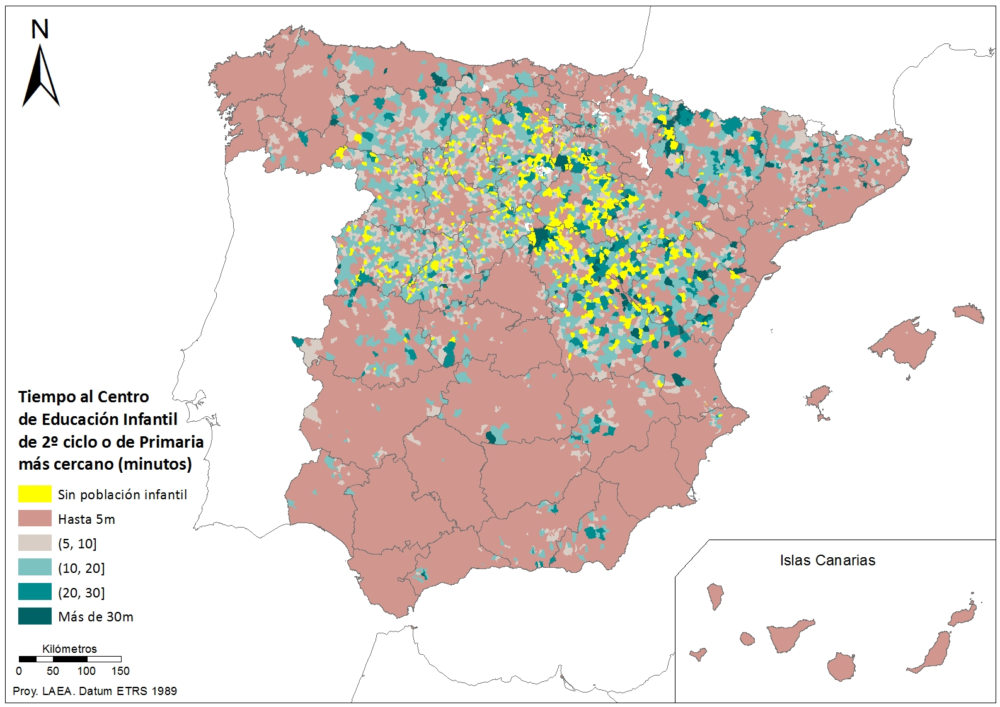
```

---

## Servicios Educativos: Centros de Secundaria `r icons::icon_style(icons::fontawesome("school"), fill = "blue")`

.bg-washed-green.b--dark-green.ba.bw2.br3.shadow-5.ph4.mt4[

- El 70% de los municipios no dispone de Centro de Educación Secundaria.

- Ello afecta al 6,7% de la población entre los 12 y los 15 años de edad.

- En términos absolutos ello representa unos 130.000 alumnos.

- El 93% de estos alumnos, unos 120.000, disponen de un centro de Secundaria en un tiempo de acceso inferior a los 20 minutos.

- El **tiempo medio de desplazamiento** a un municipio con centro educativo de este nivel es de unos **14 minutos**.

- En solo **274 municipios** los **tiempos de desplazamiento superan los 30 minutos**, y los alumnos no alcanzan los 1.500.

- El panorama es muy similar al de la educación primaria.

]

---

### .center[Tiempo de viaje al Centro de Secundaria más cercano]

```{r, echo = FALSE, eval = TRUE, fig.asp = 2/2, out.width = "98%", fig.align = "center"}
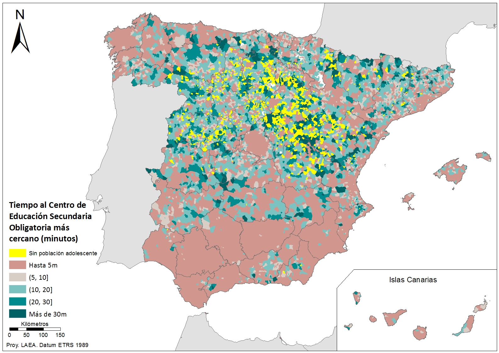
```

---

## Servicios Educativos: Centros de Bachillerato `r icons::icon_style(icons::fontawesome("school"), fill = "blue")`

.bg-washed-green.b--dark-green.ba.bw2.br3.shadow-5.ph4.mt4[

- El 79% de los municipios no dispone de Centro de Educación Secundaria.

- Ello afecta al 11% de la población entre los 16 y los 17 años de edad.

- En términos absolutos ello representa unos 105.000 alumnos potenciales —aunque esta etapa educativa no es obligatoria—.

- El 86% de estos alumnos, unos 90.000, disponen de un centro de Bachillerato en un tiempo de acceso inferior a los 20 minutos.

- El **tiempo medio de desplazamiento** a un municipio con centro de Bachillerato es de unos **18 minutos**.

- En **562 municipios** los **tiempos de desplazamiento superan los 30 minutos**, y los alumnos no alcanzan los 4.000.

]

---

### .center[Tiempo de viaje al Centro de Bachillerato más cercano]

```{r, echo = FALSE, eval = TRUE, fig.asp = 2/2, out.width = "98%", fig.align = "center"}
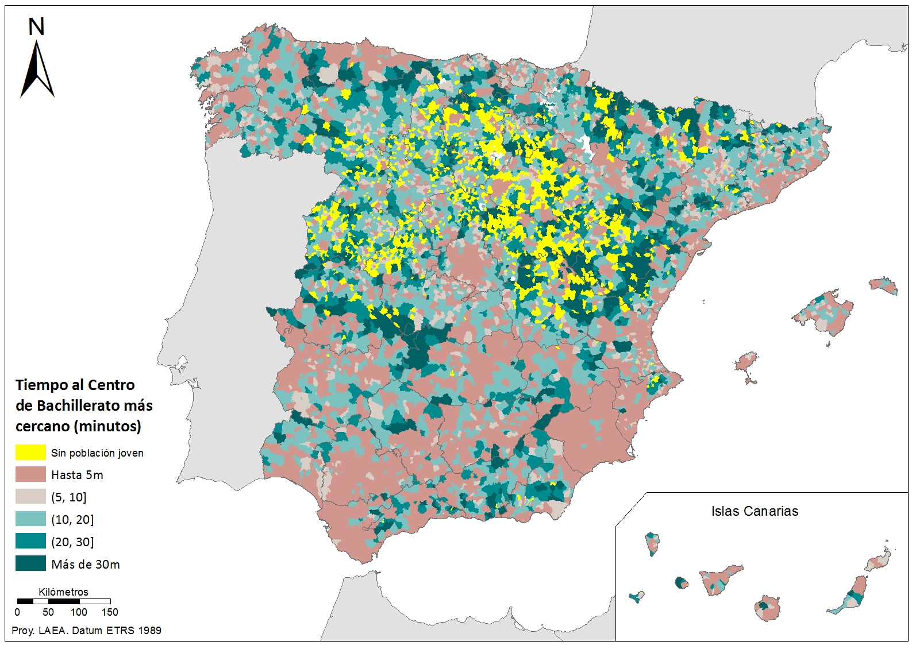
```

---

### .center[Diferencias Provinciales: % de población sin Bachiller en su municipio]

```{r, echo = FALSE, eval = TRUE, fig.asp = 2/2, out.width = "98%", fig.align = "center"}
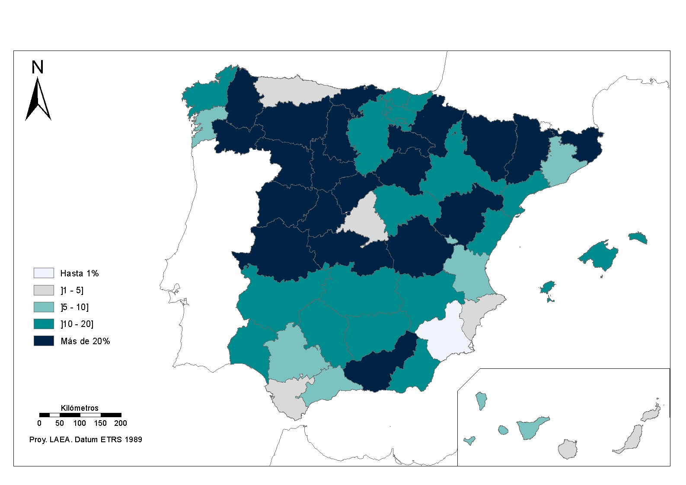
```

???

Las diferencias en la dotación de centros son notables cuando se considera la provincia como unidad territorial. A diferencia de los niveles de enseñanza básica y obligatoria, una mayor parte de la población de referencia debe desplazarse a otro municipio para atender este nivel de enseñanza, como resulta natural. Como se observa en el mapa, en una parte importante de las provincias españolas este porcentaje es superior al 20%, es decir, más de una quinta parte de la población con edad entre 16 y 17 años deben desplazarse a otro municipio si quieren recibir enseñanzas de bachillerato. La concentración geográfica de estas provincias simplemente intensifica las de anteriores niveles educativos, localizándose en el interior y norte peninsular, y superándose el 30% en 9 provincias, 4 de ellas de Castilla y León —Palencia, Salamanca, Segovia y Zamora—, además de Cáceres, Cuenca, Toledo, Teruel y Navarra. Únicamente en Murcia este porcentaje es inferior al 1%, seguida de Asturias, Madrid, Alicante, Cádiz y Las Palmas, con porcentajes inferiores al 5%. Asimismo, se observan diferencias importantes incluso dentro de algunas comunidades, como es el caso de Andalucía, Cataluña o Galicia.

---

# ¿Son nuestras estimaciones razonables?

Es difícil encontrar estudios frente a los que comparar, pero **¡creemos que sí!**

.panelset[

.panel[.panel-name[Primaria]
```{r, echo = FALSE, eval = TRUE, fig.asp = 2/2, out.width = "75%", fig.align = "center"}
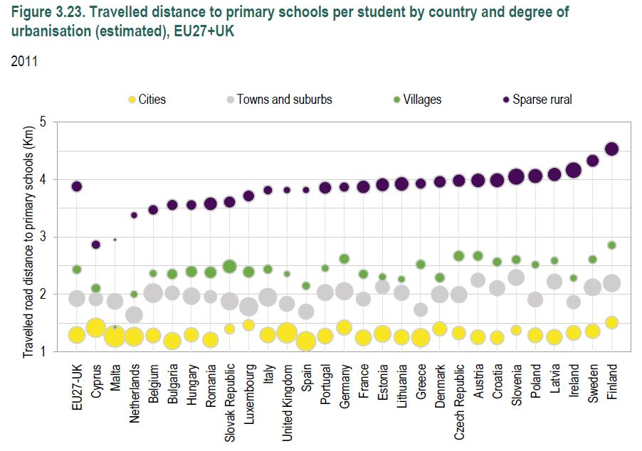
```
]

.panel[.panel-name[Secundaria]
```{r, echo = FALSE, eval = TRUE, fig.asp = 2/2, out.width = "75%", fig.align = "center"}
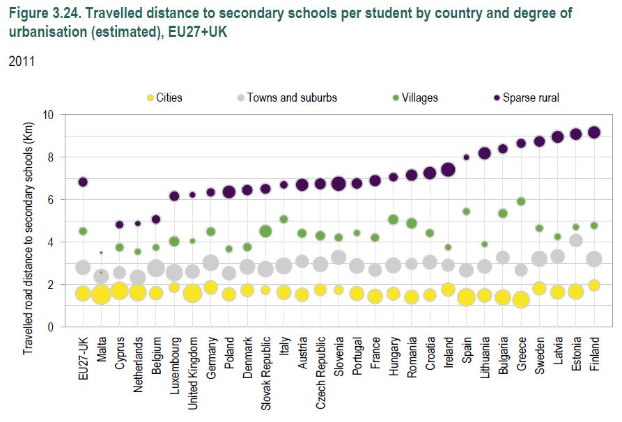
```
]

]

???

Datos de un estudio de la [OECD](https://www.oecd.org/publications/access-and-cost-of-education-and-health-services-4ab69cf3-en.htm)

**Primaria**: La máxima distancia se obtiene para el mundo rural, pero, para España, es de solo 4km.

**Secundaria**: La máxima distancia se obtiene para el mundo rural, pero, para España, es de solo 8km.

Son distancias reducidas, ¡incluso algo más que las nuestras! Obtenidas con metodologías diferentes, pero que indican que nuestras estimaciones son perfectamente razonables, y no parece que sean conservadores, incluso aunque sean reducidas.

---

## Servicios Financieros: Oficinas Bancarias `r icons::icon_style(icons::ionicons("cash"), fill = "blue")`

.bg-washed-green.b--dark-green.ba.bw2.br3.shadow-5.ph4.mt4[

- La **población** que reside **en municipios sin oficina bancaria** ha aumentado del 2% en 2008 —cuando la red alcanzó su mayor dimensión— al **3% en 2019**.

- En términos absolutos esto representa casi **1.4 millones de personas en 2019**, casi medio millón de personas más que en 2008.

- La práctica totalidad de los municipios sin oficina son **rurales**.

- El 99% de los municipios de menos de 100 habitantes carece de oficina, y en el rango entre los 100 y los 500 habitantes este porcentaje es todavía del 84%.

- La distancia media de acceso de un municipio sin oficina a la oficina más cercana es de 8km, con un tiempo estimado de unos 11 minutos.

- Las diferencias provinciales son importantes.

]

???

¡Hay más población sin Centro de Salud en su municipio que sin oficina bancaria!

Las estimaciones son acordes con las del Banco de España en su version de _work in progress_ de [_El Acceso a Servicios en la España Rural_](https://www.bde.es/f/webbde/SES/Secciones/Publicaciones/PublicacionesSeriadas/DocumentosOcasionales/21/Fich/do2122.pdf), en el que estiman ue la distancia que deben recorrer los ciudadanos de un municipio sin oficina bancaria a la oficina más cercana es de 7km.

---

### .center[Diferencias Provinciales: % Población sin oficina en su municipio]

```{r, echo = FALSE, eval = TRUE, fig.asp = 2/2, out.width = "98%", fig.align = "center"}
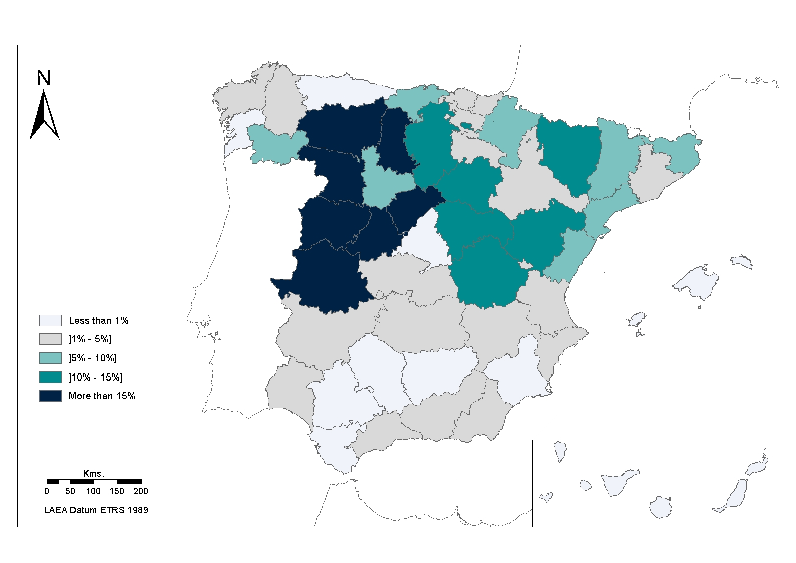
```

---

#  Limitaciones del trabajo

¡Muchas!, ¡quizá demasiadas!, pero se trataba de una **primera aproximación** a partir de un ejercicio nacional.

--

1. Examinamos un **eslabón en la cadena de accesibilidad**: la dotación de infraestructuras y su acceso geográfico.

--

2. Es necesario incorporar **servicios concretos** —Cardiología, Trauma, Urgencias, itinerarios educativos, horarios de atención,...—

--

3. Las bases de datos no son todo lo finas que deberían, ¡e incorporar servicios concretos es un desafío!

--

4. Los centros de servicios están georeferenciados. ¡En su sitio exacto! Pero la población está concentrada en un punto. ¡Sabemos que las ciudades son extensas y hay población dispersa dentro de los municipios rurales!

--

5. El tema más relevante son los **costes de provisión**.

???

1. Si hay dificultades generales de acceso no se deben a la distribución espacial de la red de centros, sino a otro tipo de cuestiones relacionadas con la disponibilidad de personal o con el flujo de organización de los servicios. Estos aspectos organizativos son una parte vital de la prestación de los servicios, sobre todo en lugares donde no existe un centro de servicios y las percepcio-nes de la población son importantes.

2. ¿Cual es el horario del Consultorio Local? ¿Hay médico en Centro de Salud? ¿Hay servicio de urgencias? ¿Cual es el horario de la oficina bancaria?...

3. Prometo no quejarme de la calidad de la información, pero esta es manifiestamente mejorable.

4. Necesitamos una distribución más fina de la población. ¿Una grid? Ello complica enormemente los problemas computacionales.

5. Los costes de provisión son esenciales anters aspectos prácticos del conflicto eficiencia-equidad.

---

# OECD: [_Access and Cost of Education and Health Services_](https://www.oecd.org/publications/access-and-cost-of-education-and-health-services-4ab69cf3-en.htm)

¡Excelente estudio! Aunque la información de base es algo anticuada, 2011, y para mi gusto tiene excesiva cocina metodológica. lo que hace a veces dificil explorar el origen de los resultados.

```{r, echo = FALSE, eval = TRUE, fig.asp = 2/2, out.width = "100%", fig.align = "center"}
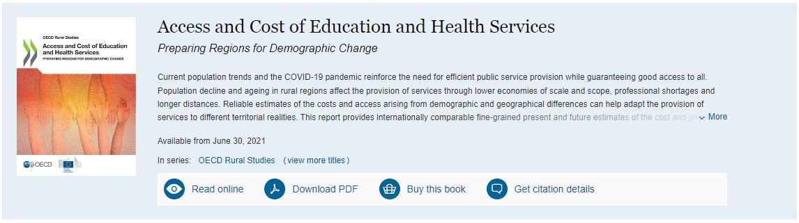
```

---

#  Conclusiones

.panelset[

.panel[.panel-name[Una]

.bg-washed-green.b--dark-green.ba.bw2.br3.shadow-5.ph4.mt4[

- La accesibilidad geográfica a servicios básicos de interés general —sanidad, educación o entidades bancarias— es buena con generalidad para el conjunto de la población.

- La mayor parte de la población tiene acceso básico a esos servi-cios en su propio municipio de residencia, y cuando ello no es así, tiene acceso al servicio en un tiempo razonable.

]

]

.panel[.panel-name[Dos]

.bg-washed-green.b--dark-green.ba.bw2.br3.shadow-5.ph4.mt4[

- Esta accesibilidad geográfica tiene, sin embargo, **dos velocidades**.

- Una de **crucero** para la gran mayoría de la población.

- Otra a **cámara lenta** para una parte muy reducida de la misma. Esta pequeña parte de la población debe desplazarse con tiempos relativamente largos, digamos en exceso a los 20 minutos para acceder a servicios básicos —centros de salud, centros educativos u oficinas bancarias— disponibles en mucho menor tiempo en cualquier municipio de tamaño medio. Tiempos mucho mayores, en exceso a los 45 minutos, para el acceso a un hospital.

]

]

.panel[.panel-name[Tres]

.bg-washed-green.b--dark-green.ba.bw2.br3.shadow-5.ph4.mt4[

- La población con peores condiciones de accesibilidad tiene características muy específicas —es población mayor, que reside en municipios de tamaño muy reducido, normalmente de montaña y con malas comunicaciones—

- Al mismo tiempo está muy localizada geográficamente en amplias zonas del interior peninsular.

- Algunas provincias aparecen repetidamente entre las que muestran peores condiciones de accesibilidad independientemente del servicio: Teruel, Cuenca, Guadalajara y varias provincias de Castilla y León como Soria, Segovia o Ávila.

- En cierta forma, y a grandes rasgos, el mapa de la accesibilidad es similar al mapa de la densidad de población.

]

]

.panel[.panel-name[Cuatro]

.bg-washed-green.b--dark-green.ba.bw2.br3.shadow-5.ph4.mt4[

- Esta dualidad, facilidad en el acceso geográfico a los centros de servicios para la gran mayoría de la población y dificultad para unos pocos, es el resultado, en gran parte, de nuestro modelo de asentamiento de la población.

- La elevada concentración de la misma en unos pocos lugares facilita el acceso geográfico a los servicios públicos, al tiempo que acota en el espacio la población con peor acceso.

]

]

.panel[.panel-name[Cinco]

.bg-washed-green.b--dark-green.ba.bw2.br3.shadow-5.ph4.mt4[

- ¿Existe la denominada **penalización rural**? **Sí**, claramente.

- Pero afortunamente está bastante acotada.

- Estos colectivos vulnerables deberán recibir atención especial.

- El principio de equidad territorial, así como la obligatoriedad por parte de las administraciones públicas de prestar ciertos servicios públicos, requiere acciones correctoras para la población con peor acceso.

]

]

]

---

background-image: url(https://www.ivie.es/wp-content/uploads/2017/02/logo.jpg), url(https://www.uv.es/recursos/fatwirepub/css/logoPeu.png)
background-position: 95% 5%, 5% 95%
background-size: 12%, 20%

class: center, middle

# ¡Gracias por la atención!

## .green[¿Preguntas?]

???

Slides created via the _R_ package [**xaringan**](https://github.com/yihui/xaringan).
